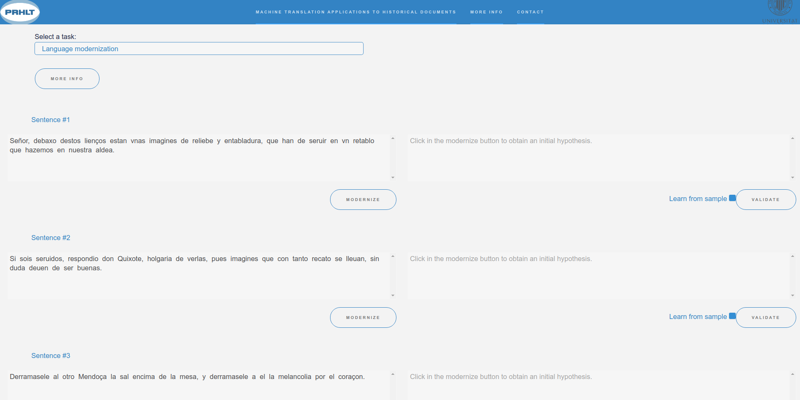

# Machine Translation Applications to Historical Documents demo



This is a web demo of some machine translation applications to historical documents.

## Table of contents
* [Structure](#structure).
* [How to run a demo server](#how-to-run-a-demo-server-see-nmt-keras).
* [How to run the PHP server](#how-to-run-the-php-server).
* [Run through Docker](#run-through-docker).

## Structure

The system follows a client-server architecture. The main files are:

- **index.html**: HTML webpage.
- **sample_server.py**: HTTP server version of the interactive sampler.
- **sampler_modernization.php**, **sampler_spelling.php**, **inmt_sampler_modernization.php** and **inmt_sampler_spelling.php** query the server to get a modernization/normalization (given a validated prefix or not).
- The `images` and `assets` directories contain some visual resources.

## How to run a demo server (see [NMT Keras](https://github.com/midobal/nmt-keras/tree/hd_demo/demo-web))

In order to provide high response rate and translation speed, it is highly recommended that the server has a GPU available.
By default, the server requires the `InteractiveNMT` branch from the [Multimodal Keras Wrapper](https://github.com/lvapeab/staged_keras_wrapper/tree/Interactive_NMT).

Run ``python sample_server.py --help`` for obtaining information about the options of the server.

We'll start the server in the localhost port 6542. We'll use a dataset instance stored in `datasets/Dataset.pkl` and a
model and config stored in `trained_models`:
```
python ./sample_server.py --dataset datasets/Dataset.pkl --port=6542  
        --config trained_models/config.pkl --models trained_models/update_15000
```

## How to run the PHP server

Finally, we need to run our php server. The php document root should point to the same `demo-web` folder. For running it in localhost, we just execute:
```
php -S localhost:8000
```

Finally, we should make `sampler.php` match our `sample_server.py` port. In `sampler_modernization.php`, `sampler_spelling.php`, `inmt_sampler_modernization.php` and `inmt_sampler_spelling.php`
the lines
```
$url = 'http://localhost:6542/?source='.urlencode($source);
```
and
```
$url = 'http://localhost:6542/?source='.urlencode($source).'&prefix='.urlencode($prefix);
```
should point to your sample_server port.

## Run through Docker
You can easily run a demo through Docker using docker-compose. To do so, first you need to deploy your models and datasets in `modernization/models`, `spelling/models`, `modernization/dataset` and `spelling/dataset`. Then, you just need to run:

```
docker-compose up
```

By default, docker-compose uses only CPU. If you want to run a demo using GPU, check [GPU support](#gpu-support). Alternative, if you want to run the demo servers individually (without the PHP server), you can have a look at this [link](https://github.com/midobal/dockerfiles/tree/master/mthd).

### GPU support
To run a demo through Docker using a GPU, you need to:

* Install nvidia-container-runtime.
* Configure a daemon.
* Restart Docker.

#### nvidia-container-runtime installation
Ubuntu:
```
curl -s -L https://nvidia.github.io/nvidia-container-runtime/gpgkey | \
  sudo apt-key add -
distribution=$(. /etc/os-release;echo $ID$VERSION_ID)
curl -s -L https://nvidia.github.io/nvidia-container-runtime/$distribution/nvidia-container-runtime.list | \
  sudo tee /etc/apt/sources.list.d/nvidia-container-runtime.list
sudo apt-get update
sudo apt-get install nvidia-container-runtime
```
For other distributions, check the [official repo](https://github.com/NVIDIA/nvidia-container-runtime#installation).

#### Daemon configuration
```
sudo tee /etc/docker/daemon.json <<EOF
{
    "runtimes": {
        "nvidia": {
            "path": "/usr/bin/nvidia-container-runtime",
            "runtimeArgs": []
        }
    }
}
EOF
```

#### Restart Docker
```
 systemctl restart docker
```


[Check out the demo!](http://casmacat.prhlt.upv.es/mthd/).
